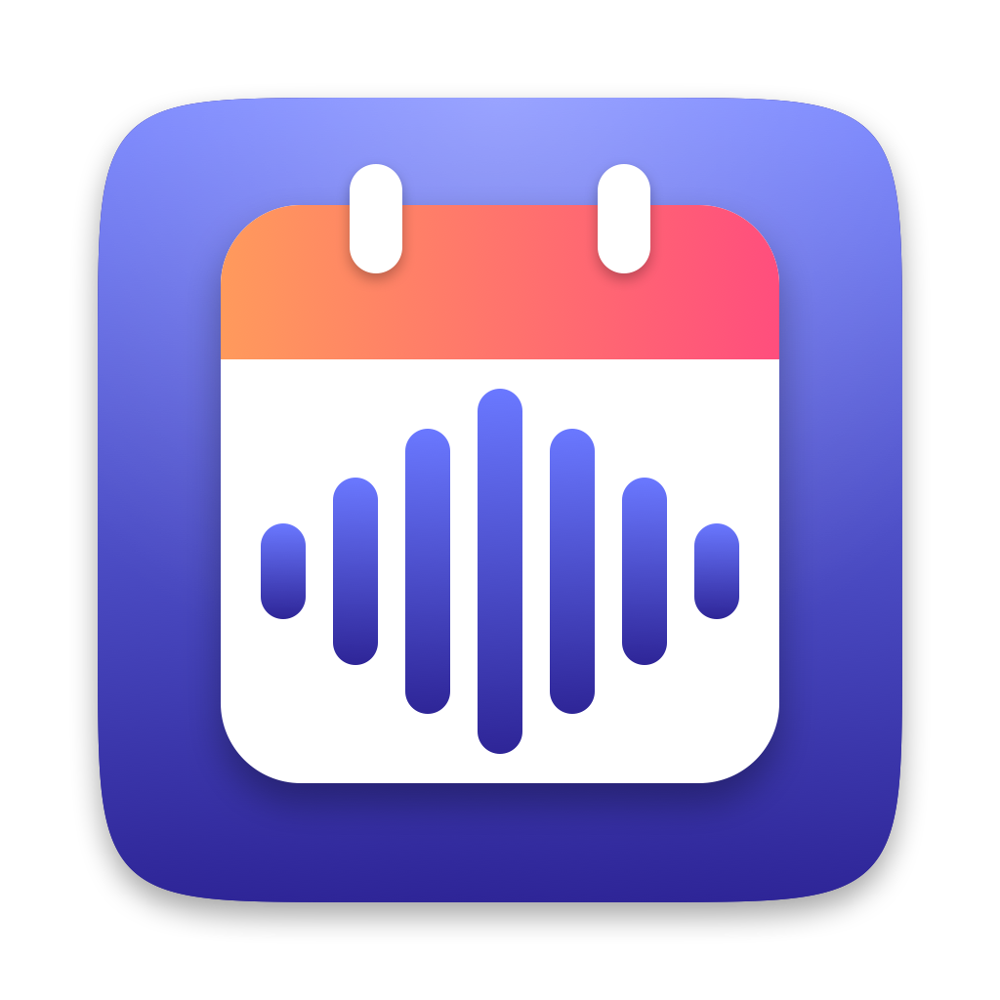
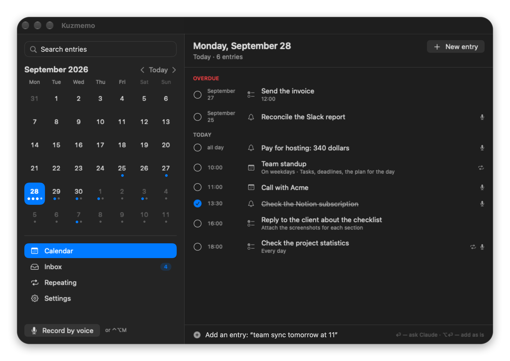
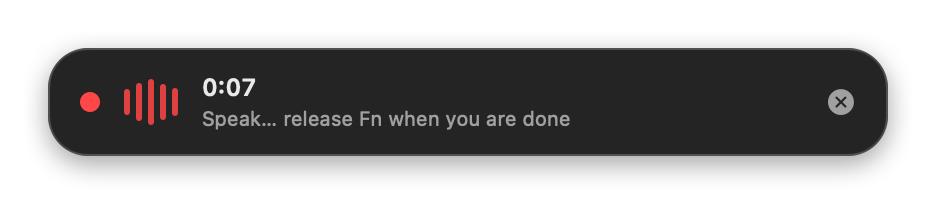
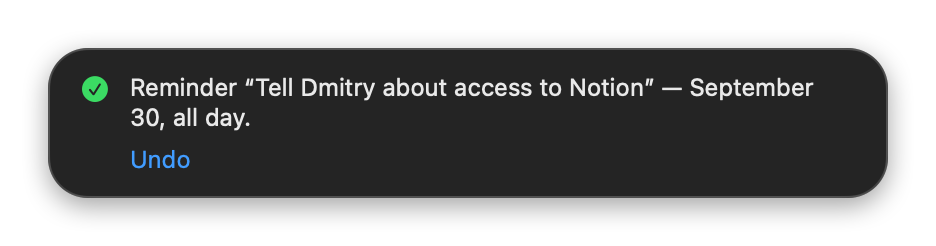
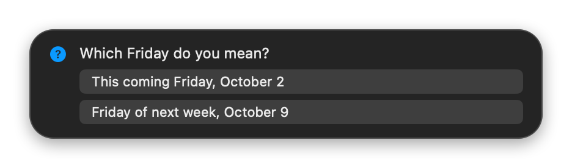
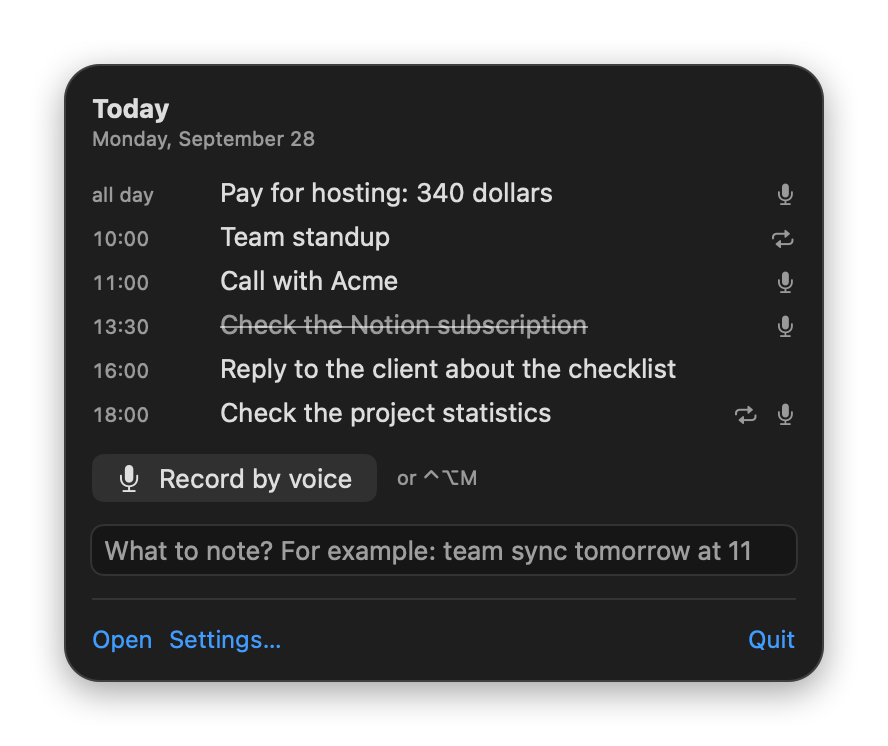

<p align="center">
  
</p>

<h1 align="center">Kuzmemo</h1>

<p align="center">
  <b>Talk to your calendar.</b><br>
  Press a key, say what you need, and it lands in a calendar of its own — or is read back to you.
</p>

<p align="center">
  
  
  
  <a href="LICENSE"></a>
</p>

<p align="center">
  <a href="#how-it-feels">How it feels</a> ·
  <a href="#features">Features</a> ·
  <a href="#quick-start">Quick start</a> ·
  <a href="#how-it-works">How it works</a> ·
  <a href="#privacy">Privacy</a> ·
  <a href="README.ru.md">Русская версия</a>
</p>

<p align="center">
  
</p>

Kuzmemo is a macOS menu-bar app. Hold **Fn** and say *"remind me the day after tomorrow to send the report"*, *"team sync tomorrow at 11"* or *"every weekday at 6 pm, check the stats"*, and the entry appears in its own calendar. Ask *"what's on today?"* and it reads the answer back.

Speech recognition runs on your Mac. Claude, through the `claude` command-line tool you already use with your Claude subscription, turns the phrase into a structured action; the app validates it, does all the date arithmetic itself and writes to a local SQLite database. Nothing is synced anywhere.

The interface, the spoken answers and the recognition are available in **English and Russian**.

## How it feels

<table>
  <tr>
    <td valign="middle"><b>1. Speak.</b><br>Hold <b>Fn</b>, or tap it to talk hands-free; the recording stops when you stop talking. A small card shows the level and the time. <b>Esc</b> cancels.</td>
    <td valign="middle"></td>
  </tr>
  <tr>
    <td valign="middle"><b>2. Confirm, or undo.</b><br>The result stays for a couple of seconds with an <b>Undo</b> button. The entry is already in the calendar; every change made by voice can be undone, also later.</td>
    <td valign="middle"></td>
  </tr>
  <tr>
    <td valign="middle"><b>3. Or be asked.</b><br>An ambiguous phrase such as "next Friday" gets a short question instead of a guess. Answer aloud, tap an option, or type.</td>
    <td valign="middle"></td>
  </tr>
  <tr>
    <td valign="middle"><b>4. Glance.</b><br>The menu-bar popover shows today, records with one click and takes typed phrases through the same pipeline.</td>
    <td valign="middle"></td>
  </tr>
</table>

## Features

**Voice**
- **One key.** **Fn** for hands-free (tap) or push-to-talk (hold). **⌃⌥M** works without any extra permission.
- **Ordinary phrases.** Reminders, events, tasks and notes; "tomorrow", "next Monday", "in two hours", "every weekday at 6 pm", "on the 25th".
- **Answers aloud.** "What's on today?", "what do I have tomorrow", "what's overdue", "find everything about the budget". Simple questions are answered locally in about half a second, and what has already passed today is not read out.
- **The right microphone.** When macOS has selected a Bluetooth headset as the input, Kuzmemo records with the built-in microphone instead: a headset needs a few seconds to switch to call mode, which eats the first words. Settings → Recording lets you pick any input.
- **Voices.** The system voice, or an optional neural voice that runs locally: [Silero](https://github.com/snakers4/silero-models) (Russian, in a small Python helper) or, as an experiment, your own voice ("My voice", Russian), learned from a short recording of you with [omnivoice.cpp](https://github.com/ServeurpersoCom/omnivoice.cpp).
- **Glossary.** Teach it names and jargon: how they are misheard, how they are written, how a voice should say them. It starts empty and can be exported and imported as JSON.

**Calendar**
- **A calendar of its own.** Month grid, day list, an Inbox for undated notes and for phrases that could not be processed yet, recurring entries, full-text search that understands word forms, and an editor with a live description of the repeat rule.
- **Notifications you control.** System notifications with your own lead times (10 and 5 minutes before a meeting and at the start, say), several reminders a day for entries without a time, your own sounds or macOS sounds, snooze buttons, quiet hours.

**Trust**
- **Nothing is lost.** The recording is stored before recognition and the text before it is sent; if `claude` is unavailable, the phrase waits in the Inbox and is retried.
- **Everything is undoable.** Deletes are soft and every change goes through an undo journal that survives restarts.
- **Backed up.** A copy of the database is saved every day (the last 14 are kept), the database is checked at every launch, and an erase saves a copy first. Settings → Data shows all of it.
- **Private by design.** Audio never leaves the Mac and is deleted after transcription. See [Privacy](#privacy).

## Quick start

**Download.** The [latest release](https://github.com/egerkuzma/kuzmemo/releases/latest) has a disk image, `Kuzmemo-<version>-arm64.dmg` (Apple silicon, macOS 26 or later). Drag the app to Applications. It is signed ad hoc and not notarized by Apple (this is a personal project, there is no Developer ID), so macOS asks you to confirm the first launch: System Settings > Privacy & Security > *Open Anyway* (`HOW-TO-OPEN.txt` in the image explains it step by step). You still need Claude Code signed in, and you download a speech model in *Settings > Recognition*. Because the signature is ad hoc, macOS asks for the microphone and Input Monitoring again after every update.

**Or build it from source.** Requirements: macOS 26 or later (Apple silicon recommended), Xcode 26 or later (Swift 6.2+), [Claude Code](https://claude.com/claude-code) installed and signed in with `claude auth login` (Kuzmemo calls `claude -p`, so it uses your Claude subscription; there is no API-key mode), and about 2 GB of disk for the speech model.

```bash
git clone https://github.com/egerkuzma/kuzmemo.git && cd kuzmemo

# 1. A code-signing certificate, once. macOS ties the microphone and Input Monitoring permissions to the app's signature;
#    an ad-hoc build would lose them on every rebuild. Keychain Access > Certificate Assistant > Create a Certificate
#    (Identity Type: Self Signed Root, Certificate Type: Code Signing). Then tell the script which one to use:
export KUZMEMO_SIGN_IDENTITY="<certificate name or SHA-1 hash>"   # or put it in the git-ignored file signing/identity

# 2. Build, sign, install to ~/Applications and launch
scripts/run_app.sh --prod
```

On first launch grant **Microphone**, **Input Monitoring** (needed for the Fn key; the ⌃⌥M chord works without it) and **Notifications**, then download the speech model in **Settings → Recognition**. If Fn opens the emoji picker or dictation, set *System Settings → Keyboard → Press 🌐 key to* **Do Nothing**.

The optional neural voice needs about 800 MB more: run `scripts/install_silero.sh` (Python 3.10+; it creates its own environment and downloads the model into `~/Library/Application Support/Kuzmemo/silero`), then choose it in *Settings → Speech*.

The experimental "My voice" needs about 1 GB and the Xcode command line tools with CMake: run `scripts/install_omnivoice.sh` (it builds a small native program and downloads the model into `~/Library/Application Support/Kuzmemo/omnivoice`), choose it in *Settings → Speech*, then pick a recording of your own voice (8 to 12 seconds of clear speech) and check the words said in it. It starts speaking a few seconds after an answer is ready, while the other voices start at once; sentences it has said before are kept and play immediately.

### Things to say

| Say | What happens |
|---|---|
| "Remind me the day after tomorrow to call the bank" | An all-day reminder, announced at the times you chose |
| "Team sync tomorrow at eleven" | An event at 11:00, with an early warning if you enabled it |
| "Every Monday at ten stand-up" | A repeating event |
| "What's on today?" | Read aloud from your calendar, no network involved |
| "Move the meeting with Anna to Thursday" | The matching entry is changed (with Undo) |
| "Next Friday, sync at three" | "Which Friday?" with two buttons; answer aloud or tap |

**⌘,** opens the settings; the **Calendar** window is the full month view.

## How it works

```
key → microphone → on-device Whisper (WhisperKit) → transcript
    → local fast path for simple questions, or `claude -p` (no tools, strict JSON schema)
    → validation (allow-listed actions, dates computed by the app, clarification rules)
    → SQLite + undo journal → card / spoken answer / notifications
```

- **Claude describes, the app computes.** The model returns structure ("a weekday, next week, at 11"); date arithmetic, validation and every write are deterministic app code. A second, independent reading of simple date phrases cross-checks the model.
- **Untrusted input.** Transcripts and calendar text are data, never instructions: the model gets no tools, answers under a strict schema, may only ask for allow-listed actions, and deletes are soft with Undo.
- **Nothing is lost.** Every phrase is persisted before each stage; a failure leaves an Inbox card with a retry, and interrupted work is finished at the next launch.
- **Testable without a person.** A UI-free core, recorded model answers (a golden set of about sixty phrases, also runnable against the real `claude -p`), and a control socket in the development build that drives the real app.

Three SwiftPM targets: `KuzmemoCore` (UI-free logic and storage on GRDB, fully unit-tested), `KuzmemoSTT` (WhisperKit behind a protocol) and `Kuzmemo` (the app).

## Privacy

Everything lives in `~/Library/Application Support/Kuzmemo` (the database and its daily copies, models). Audio is a temporary file, removed as soon as the text is stored. Only the recognized text of a phrase, your glossary terms and the titles of a few nearby calendar entries go to Anthropic, through Claude Code; nothing else leaves the Mac.

## Development

```bash
swift test                                   # unit tests; the golden set replays recorded model answers offline
KUZMEMO_LIVE_CLAUDE=1 swift test --filter liveAgainstClaude   # the golden set against the real `claude -p`
python3 scripts/check_localization.py        # translation tables against the code
scripts/run_app.sh                           # the automation build, then scripts/e2e/*.py drive the real app
```

The development build is muted, ignores the keyboard trigger, never opens the microphone and exposes a control socket, so the end-to-end scripts (`scripts/e2e/voice.py`, `calendar.py`, `settings.py`, `notifications.py`, `silero.py`, `clone.py`, `mute.py`, `data.py`) can drive the real app without a person; speech fixtures come from `scripts/fixtures/make_synth.sh`. The interface is localized with English source keys and Russian translation tables. The app icon is drawn by `scripts/make_icon.swift`, and the pictures above come from `scripts/screenshots.py --readme`.

Issues and pull requests are welcome. Code, comments, docs and commit messages are in English (Conventional Commits); user-visible text goes through the translation tables. Please keep personal data out of examples and tests.

Status: version 1.0. The voice path, the calendar window, settings, notifications, database copies and the bilingual interface are done. It is a personal project: the download is signed ad hoc and not notarized, or you can build it from source (see [Quick start](#quick-start)).

## License

MIT, see [LICENSE](LICENSE). Kuzmemo builds on GRDB, WhisperKit and KeyboardShortcuts (all MIT). The speech models are downloaded when you install them and are not part of this repository: Whisper (MIT); the optional Silero voice model is licensed CC BY-NC-SA 4.0 and the model behind "My voice" (OmniVoice) CC BY-NC, both for non-commercial use.
